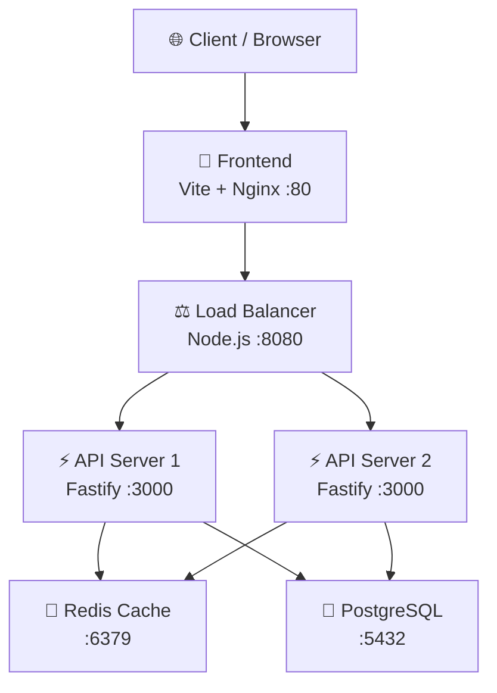

# 📊 Snip — Full Project Documentation
Everything you need to know about the **Snip URL Shortener**—from high-level architecture to low-level implementation.

---

## 🌟 1. Overview
**Snip** is a production-ready, high-performance URL shortening service. Its goal is to provide a reliable way to create short aliases for long URLs, with a focus on **low latency** (<100ms redirection), **scalability** (multi-node architecture), and **real-time analytics** (click tracking and device breakdown).

---

## 🏗️ 2. High-Level Architecture
The system follows a layered architecture to ensure separation of concerns and easy scaling.

### **The Layers:**
*   **Frontend**: A responsive dashboard for managing links and viewing analytics. Built with Vanilla JS for maximum speed.
*   **Load Balancer**: A custom proxy that implements **Least Connections** and **Active Health Checks**. It automatically stops sending traffic to any API node that is down.
*   **API Cluster**: Multiple instances of the Fastify server handling URL creation, listing, and redirection.
*   **Cache (Redis)**: Stores "hot" URL mappings in memory for sub-millisecond lookups.
*   **Persistent Store (Postgres)**: The source of truth for all URLs and long-term analytics logs.

---

## 🔄 3. How It Works (Request Flow)

### **A. URL Shortening Loop**
1.  **Frontend**: Sends a `POST` request to `/api/shorten`.
2.  **API**: Generates a unique 7-character ID (using **NanoID**).
3.  **DB**: Inserts the mapping into PostgreSQL.
4.  **Cache**: Simultaneously sets the mapping in Redis with a 24-hour expiration.
5.  **Response**: Returns the short URL to the user.

### **B. Redirection Flow (The Hot Path)**
1.  **Request**: User visits `localhost/abc123`.
2.  **Redis Lookup**: API checks Redis first.
    *   **HIT (<1ms)**: Server sends a **301 Permanent Redirect** immediately.
    *   **MISS**: Server checks Postgres → Finds URL → Re-caches in Redis → Redirects.
3.  **Async Analytics**: The server records the click, user agent, and referrer in the background (asynchronously) so the user doesn't wait for the database write.

---

## 🧰 4. The Tech Stack (Rationale)

| Technology | Why we used it? |
|-------------|-----------------|
| **Fastify** | **Performance**: It is one of the fastest Node.js frameworks with minimal overhead per request. |
| **TypeScript** | **Reliability**: Catches bugs during development through strict typing. |
| **Redis** | **Speed**: Essential for sub-100ms redirection goals. Essential for high-traffic "hot" links. |
| **PostgreSQL** | **Persistence**: Robust, ACID-compliant database for long-term data integrity. |
| **Docker** | **Consistency**: Ensures the app runs perfectly on your laptop and in production. |
| **Vanilla JS** | **Simplicity**: No heavy framework (like React/Angular) means the dashboard loads instantly. |

---

## 📡 5. API Reference

| Endpoint | Method | Description |
|----------|---------|-------------|
| `/api/shorten` | `POST` | Creates a new short URL. |
| `/api/urls` | `GET` | Paginated list of all active URLs. |
| `/api/analytics/:id` | `GET` | Get clicks, device types, and time-series data for a link. |
| `/api/stats` | `GET` | Overall dashboard metrics (Total clicks, active links, health). |
| `/health` | `GET` | System health check (checks DB and Cache status). |

---

## 🗃️ 6. Database Schema
We used a **denormalized** design for speed:
*   `urls`: Stores mapping, creator IP, and a `click_count` (updated on every click for fast dashboard reads).
*   `url_analytics`: Granular logs for every click (referer, device, country).

---

## ⚙️ 7. System Design Decisions
*   **NanoID vs Numeric Keys**: NanoID (7 chars) provides trillions of combinations without the predictability of auto-increment IDs (security through obscurity).
*   **Least Connections Strategy**: Our Load Balancer routes traffic to the server that is currently handling the least amount of work, balancing the load perfectly.
*   **SSL Support**: Configured for Render/Cloud security requirements out of the box.

